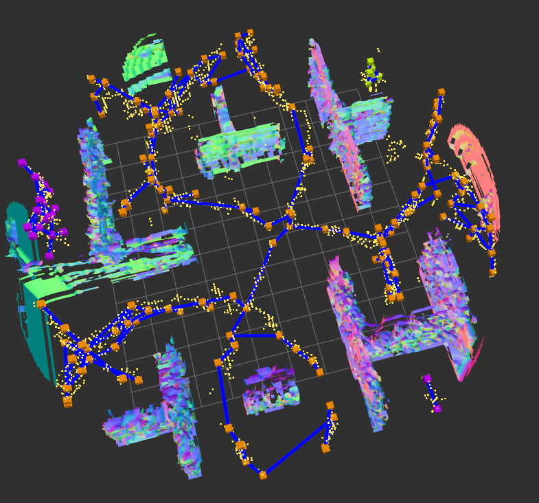

# GVD Skeleton Planner

A ROS-based planning package that generates skeleton graphs from ESDF using Generalized Voronoi Diagrams (GVDs)

## Installation
This package is intended to be used with [mav_voxblox_planning](https://github.com/ethz-asl/mav_voxblox_planning)

```bash
mkdir -p ~/catkin_ws/src
cd ~/catkin_ws
catkin init
catkin config --extend /opt/ros/kinetic
catkin config --cmake-args -DCMAKE_BUILD_TYPE=Release
catkin config --merge-devel
```
If using [**SSH keys for github**](https://help.github.com/articles/connecting-to-github-with-ssh/) (recommended):
```bash
cd ~/catkin_ws/src/
git clone git@github.com:ChanJoon/mav_voxblox_planning.git
wstool init . ./mav_voxblox_planning/install/install_ssh.rosinstall
wstool update
```

If **not using SSH** keys but using https instead:
```bash
cd ~/catkin_ws/src/
git clone https://github.com/ChanJoon/mav_voxblox_planning.git
wstool init . ./mav_voxblox_planning/install/install_https.rosinstall
wstool update
```

If you have already initalized wstool replace the above `wstool init` with `wstool merge -t`

### Clone this package and Build

```bash
cd ~/catkin_ws/src/
git clone git@github.com:ChanJoon/gvd_skeleton_planner.git
cd ..
catkin build
```

## Try out Skeleton generation and planning
### Running

```
roslaunch gvd_skeleton_planner voxblox_skeleton.launch
```



### Get the planning panel

Make sure all the packages have built successfully! Re-source your workspace and start up rviz.

```bash
source devel/setup.bash
rviz
```

In rviz, select `Panels -> Add New Panel` and select `Planning Panel`:


Next, under `Displays`, add an `InteractiveMarkers` display with the topic `/planning_markers/update`:


You should now see both a path panel and start and goal arrows. You can select `Edit` on either the start or the goal to drag it around as an interactive marker:


You can also edit the numbers in the x, y, z, yaw fields manually; the markers and the numbers will update automatically to match.

### Using the Skeleton planner:

In the planning panel,
  1. enter `voxblox_skeleton_planner` as the planner name
  2. add a `VoxbloxMesh` display with the topic `/voxblox_skeleton_planner/mesh`
  3. add a `MarkerArray` display with the topic `/voxblox_skeleton_planner/path`.
  4. Additionally you can add a `MarkerArray` with topic `/voxblox_skeleton_planner/sparse_graph`

You can now press the "Planner Service" button to plan! 
Pink is the shortened path from the sparse graph, and teal is smoothed using loco through it.


## Reference
[Sparse 3D Topological Graphs for Micro-Aerial Vehicle Planning](https://arxiv.org/abs/1803.04345)

```
@INPROCEEDINGS{8594152,
  author={Oleynikova, Helen and Taylor, Zachary and Siegwart, Roland and Nieto, Juan},
  booktitle={2018 IEEE/RSJ International Conference on Intelligent Robots and Systems (IROS)}, 
  title={Sparse 3D Topological Graphs for Micro-Aerial Vehicle Planning}, 
  year={2018},
  volume={},
  number={},
  pages={1-9},
  keywords={Planning;Three-dimensional displays;Two dimensional displays;Skeleton;Robot sensing systems;Topology},
  doi={10.1109/IROS.2018.8594152}}
```