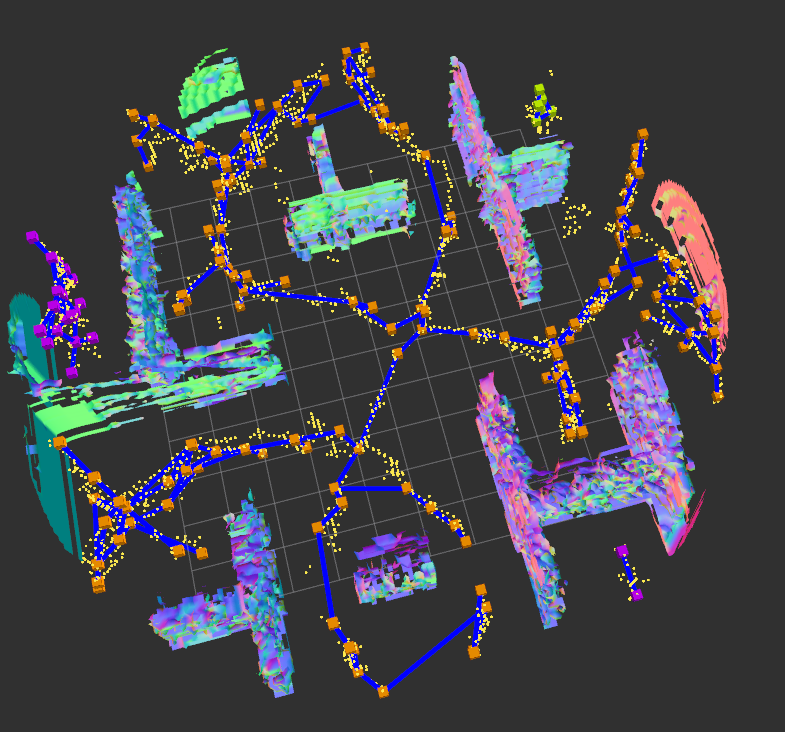

# GVD Skeleton Planner

> ⚠️ This project is currently UNDER DEVELOPMENT

A ROS-based planning package that generates skeleton graphs from ESDF using Generalized Voronoi Diagrams (GVDs)

## Installation
This package is intended to be used with [voxblox](https://voxblox.readthedocs.io/en/latest/pages/Installation.html)

For ROS1 Noetic, if you met TF lookup issue in `voxblox`, use forked version of [voxblox](https://github.com/ChanJoon/voxblox).

### Clone this package and Build

```bash
cd ~/catkin_ws/src/
git clone git@github.com:ChanJoon/gvd_skeleton_planner.git
cd ..
catkin config -DCMAKE_BUILD_TYPE=Release
catkin build
source devel/setup.bash # devel/setup.zsh
```

## Try out Skeleton generation and planning
### Running

```
roslaunch gvd_skeleton_planner voxblox_skeleton.launch
```



## TODOs
- [x] Refactor and clean up legacy or unused code
- [ ] Implement core planning functionalities


## Reference
[Sparse 3D Topological Graphs for Micro-Aerial Vehicle Planning](https://arxiv.org/abs/1803.04345)

```
@INPROCEEDINGS{8594152,
  author={Oleynikova, Helen and Taylor, Zachary and Siegwart, Roland and Nieto, Juan},
  booktitle={2018 IEEE/RSJ International Conference on Intelligent Robots and Systems (IROS)}, 
  title={Sparse 3D Topological Graphs for Micro-Aerial Vehicle Planning}, 
  year={2018},
  volume={},
  number={},
  pages={1-9},
  keywords={Planning;Three-dimensional displays;Two dimensional displays;Skeleton;Robot sensing systems;Topology},
  doi={10.1109/IROS.2018.8594152}}
```

## License

This work is distributed under the BSD-3-Clause License.

It is based in part on the [mav_voxblox_planning](https://github.com/ethz-asl/mav_voxblox_planning)